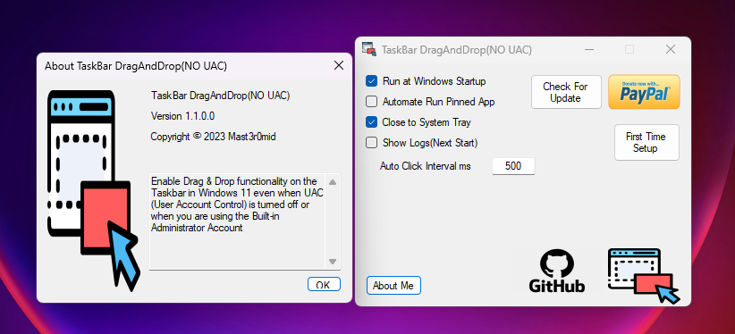

# TaskBar Drag&Drop(No UAC)

TaskBar Drag And Drop(No UAC) allows you to enable Drag & Drop functionality on the Taskbar in **Windows 11** even when UAC (User Account Control) is turned off or when you are using the <code>Built-in Administrator</code> Account. This tool removes the need for <code>UndockingDisabled</code> or the restoration of the <code>classic taskbar</code>.

---

**Note:** This application does not modify system settings except for making necessary Registry changes to set the app to run automatically in Windows.

## Features
- Enable <code>running pinned apps</code> from the taskbar while dragging files. 
- Enables Drag & Drop on the Taskbar in Windows 11 without requiring <code>UAC</code> or changing the taskbar to <code>classic mode</code>.
- Enable drag and drop on the built-in Administrator account.
- Tested on Windows 11 22H2 (OS Build: 22621.2361 and 22621.2428).
- Supports multiple screens.

## Installation

1. Download the latest release from the [Releases](https://github.com/Mast3r0mid/TaskBarDragAndDropNoUAC/releases/tag/release) page.
2. Extract Zip file.
3. Run the executable file to enable Drag & Drop on your Windows 11 Taskbar.

## Usage

1. Launch the application.
2. Follow the on-screen instructions to enable Drag & Drop functionality.
3. Enjoy the convenience of Drag & Drop on your Windows 11 Taskbar!

## Why Pre-Releases?

Our pre-release versions are early builds of the software that include the latest patches and updates. By using these versions, you get a sneak peek into what's coming in the next official release. You can help us test and provide valuable feedback on these pre-release versions to ensure that the final release is as polished as possible.

## How to Access Pre-Releases

1. Go to the [Releases](https://github.com/Mast3r0mid/TaskBarDragAndDropNoUAC/releases) tab in this repository.
2. Look for the pre-release versions labeled as "Pre-release" or "Release Candidate."
3. Download the version that interests you.

## Providing Feedback

If you encounter any issues, have suggestions, or want to report a bug, please open an issue in this repository. Your feedback is incredibly valuable in making this project better.

## Notes

- Keep in mind that pre-release versions may contain some unfinished or experimental features. They are intended for testing purposes.
- If you prefer stability over new features, you may want to stick with the latest official release.

Thank you for being a part of our community, and we hope you enjoy the pre-release versions. Your involvement and feedback help us build a better product.

Happy testing!

## License

This project is licensed under the **GNU General Public License, Version 3**. License - see the [LICENSE](https://github.com/Mast3r0mid/TaskBarDragAndDropNoUAC/blob/master/LICENSE) file for details.

## Support

If you find this project helpful and would like to support its development, you can make a donation via [PayPal](https://www.paypal.com/donate/?hosted_button_id=H8J45TXLNUQKW).

## Support and Contributions

If you encounter any issues or have suggestions for improvements, please [open an issue](https://github.com/Mast3r0mid/TaskBarDragAndDropNoUAC/issues).

Contributions are welcome! Feel free to fork the repository and submit pull requests.

